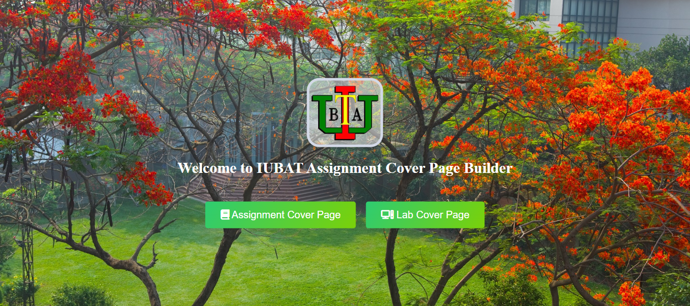
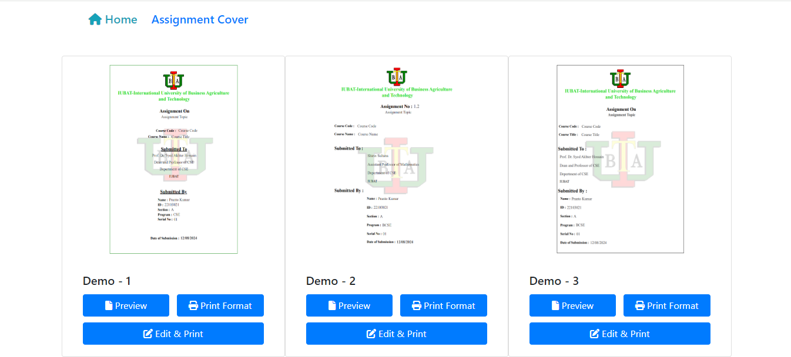
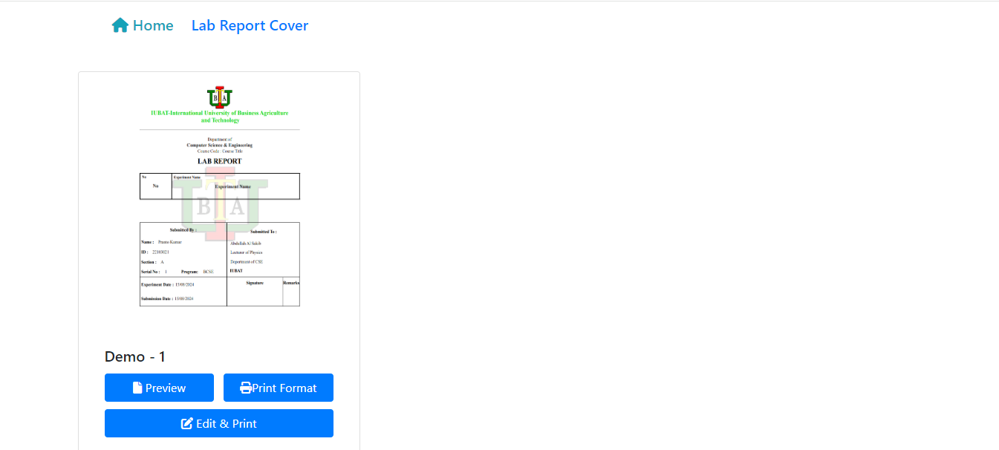
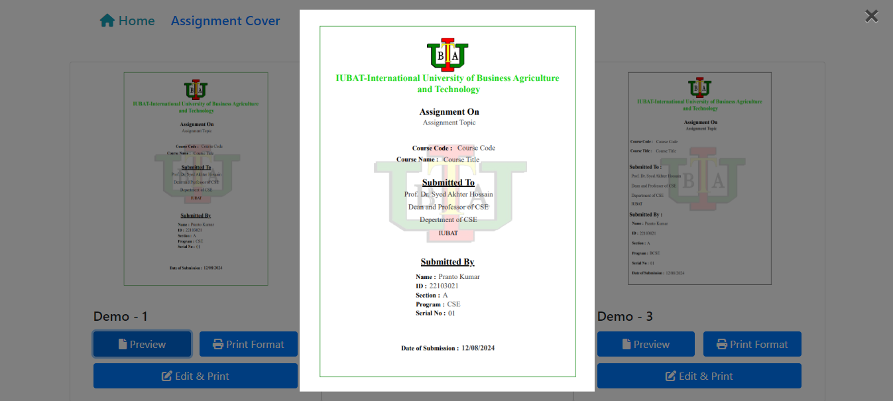
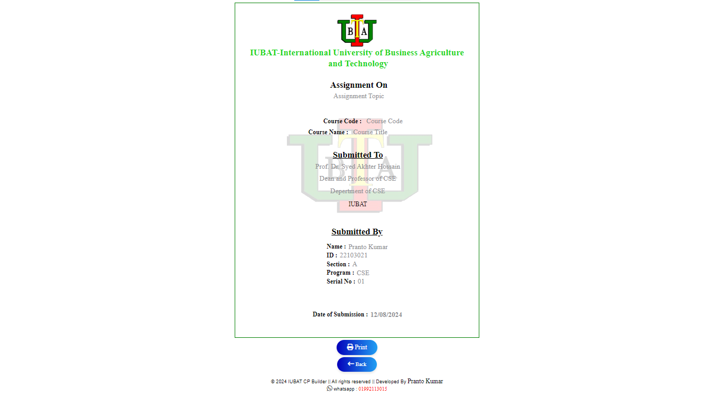
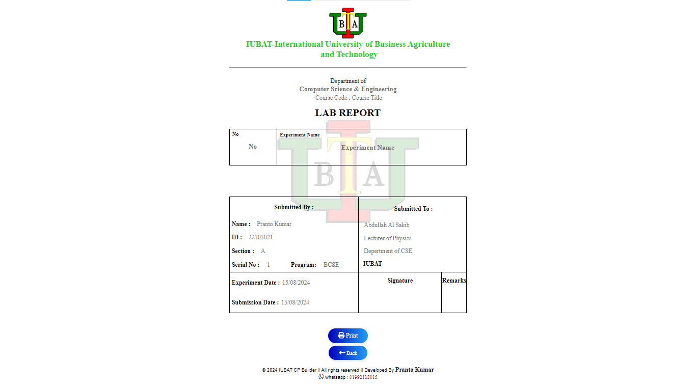

# IUBAT assignment & lab report cover page builder 

## 1. Description

The IUBAT Assignment & Lab Report Cover Page Builder is a tool designed to help students at the International University of Business Agriculture and Technology (IUBAT) create professional and standardized cover pages for their assignments and lab reports. The builder typically includes fields for course details, assignment title, student information, submission date, and instructor name, ensuring all necessary details are presented clearly and consistently.

**Home Page**


**Assignment Cover Page**


**Lab Report Cover Page**


**Assignment Cover Page Preview**


**Assignment Cover Page Edit & Preview**


**Lab Report Cover Page Edit & Preview**



## 2. Installation

If you run this project locally, then follow these steps

1. Clone the Repository

   ```sh
   https://github.com/pranto113015/IUBAT_CP_Builder.git
   ```

2. Navigate to the Project Directory
3. Open the project by vs code applicaton
4. Click the run option of the menu bar and again click the start debugging or open with live server

Or you can do this way

1. Download the project
2. unzip file
3. open with your IDE such as vs code
4. open with live server

## 3. Usage

Make professional and standardized cover pages for their assignments and lab reports.

## 4. Features 
- **Responsive Home Page** : This is a web page designed to automatically adjust its layout and content based on the device and screen size being used

## 5. Technologies Used
- **Front-end** : HTML , CSS, Bootstrap v4.4.1
- **Back-end** : JavaScript
- **Icons** : Font Awesome


## 6. Contributing

Contributions are what make the open-source community such an amazing place to be, learn, inspire, and create. Any contributions you make are greatly appreciated.Here are some ways you can get started:

- **Report bugs** : If you encounter any bugs, please let us know. Open up an issue and let us know the problem.
- **Contribute code** : If you are a developer and want to contribute, follow the instructions below to get started!
- **Suggestions** : If you don't want to code but have some awesome ideas, open up an issue explaining some updates or imporvements you would like to see!
- **Documentation** : If you see the need for some additional documentation, feel free to add some!

#### Instructions

1. Fork the Project
2. Create your Feature Branch

   ```sh
   $ git checkout -b feature/AmazingFeature
   ```

3. Commit your Changes

   ```sh
   git commit -m 'Add some AmazingFeature'
   ```

4. Push to the Branch
   ```sh
   git push origin feature/AmazingFeature
   ```
5. Open a Pull Request

## 7. License

State the license under which your project is distributed.

This project is licensed under the MIT License - see the LICENSE file for details.

## 8.Contact

If you have any questions or need further clarification, please feel free to reach out to me

**💌 Email : pranto113015@gmail.com**

**🕵️‍♂️ Linkedin : [Pranto Kumar](https://www.linkedin.com/in/pranto-kumar-a326801b3/)**

💙 Thank you for reviewing my project ⭐👨‍💻✍

## 9. Acknowledgements

Online support made this project possible.

**You can see the live demo project [Click Here](https://pranto113015.github.io/IUBAT_CP_Builder/)**

- - - 
© 2024 Pranto Kumar, Front End-Web Developer. All Rights Reserved.